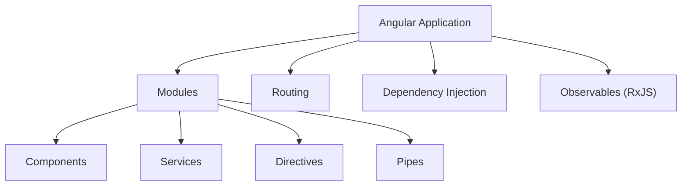
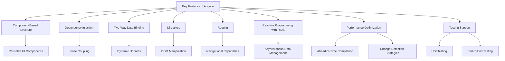
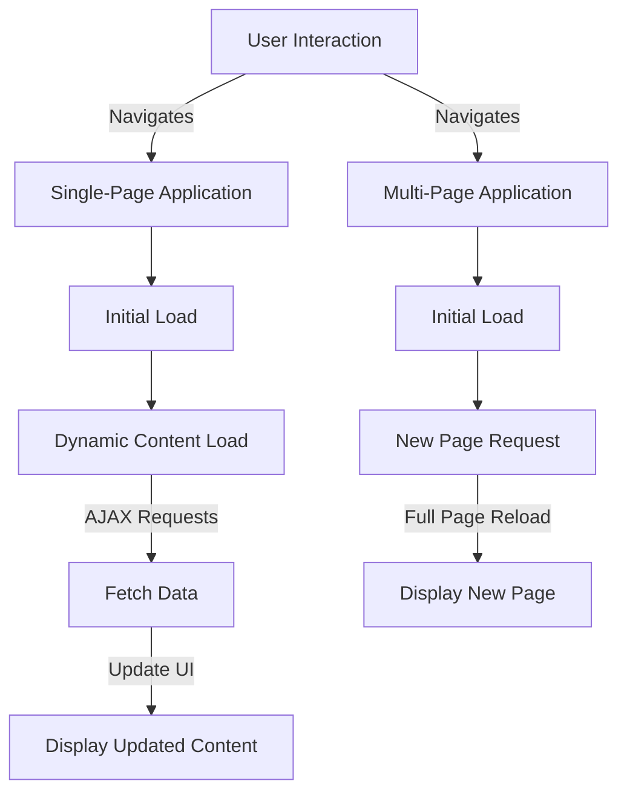
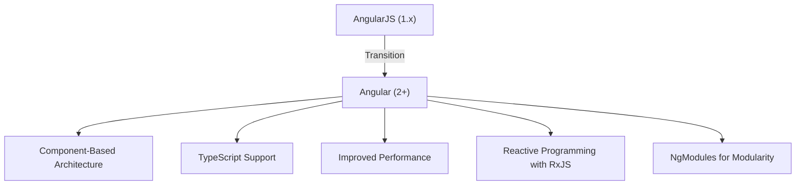
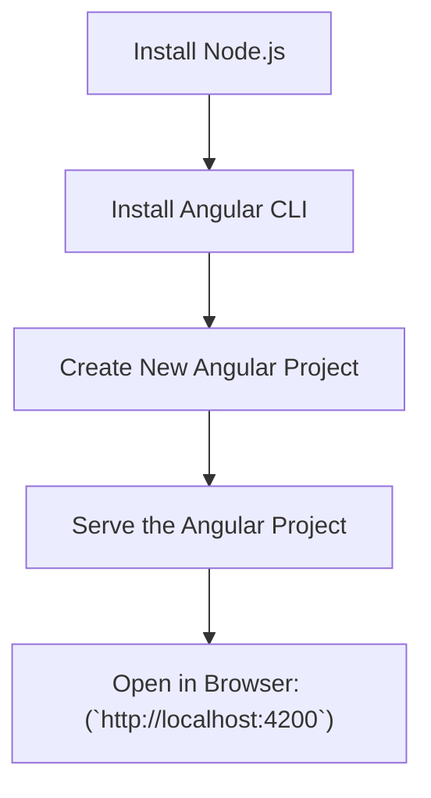
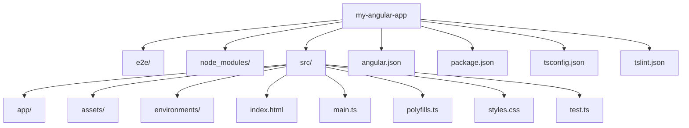

# MODULE-01 :

## 1. Introduction to Angular
- **What is Angular?**
  - A modern web application framework maintained by Google.
  - Built for developing single-page applications (SPAs) with a modular architecture.
- **History and Evolution**
  - Transition from AngularJS (Angular 1.x) to Angular (2+).
  - Overview of Angular’s version history and major changes.
- **Setup**
  - **System Requirements:** Node.js version and npm.
  - **Angular CLI:** Installing and using the Angular Command Line Interface.
  - **Creating an Angular Project:** Using commands like `ng new`, and `ng serve`.
- **Project Structure**
  - Detailed explanation of files and folders generated by Angular CLI:
    - `src/app`: Contains components, services, and modules.
    - `assets`: Static assets like images and stylesheets.
    - `environments`: Configuration for different environments (dev, prod).

---

# What is Angular?
Angular is a powerful, modern web application framework developed and maintained by Google. It is specifically designed for building single-page applications (SPAs) that provide a seamless user experience through dynamic content updates without requiring a full page reload.

## Key Characteristics of Angular

### 1. Framework Type:

- Angular is a complete, opinionated framework that offers a rich set of tools and features for web application development. Unlike libraries, which often require additional tools to manage application architecture, Angular provides a cohesive platform for building applications.

### 2. Single-Page Application (SPA) Development:

- SPAs load a single HTML page and dynamically update content as the user interacts with the app. This approach minimizes server requests and enhances performance, providing users with a smooth and responsive experience.
- Angular achieves this through its sophisticated routing system, which enables navigation between different views without page reloads.

### 3. Modular Architecture:

- Angular's architecture is built around modules, which encapsulate related components, services, directives, and pipes. This modular approach promotes reusability and maintainability of code, making it easier to manage large applications.
- Modules can be lazy-loaded, allowing parts of the application to be loaded on-demand, further enhancing performance.



## Core Features

### 1. Component-Based Structure:

- Angular applications are constructed using components, which are self-contained units of the user interface. Each component consists of an HTML template, a TypeScript class, and associated styles.
- This structure allows developers to build reusable UI components, improving consistency and reducing redundancy.

### 2. Dependency Injection:

- Angular has a powerful dependency injection (DI) system that facilitates the management of service instances and promotes loose coupling between components and services.
- DI makes it easier to test applications by allowing the injection of mock services during unit tests.

### 3. Two-Way Data Binding:

- Angular implements two-way data binding, which synchronizes data between the model and the view. Changes in the model automatically update the view, and vice versa, simplifying the process of handling user input and dynamic content.

### 4. Directives:

Directives are special markers in the DOM that tell Angular to attach specific behavior to elements or manipulate the DOM in specific ways. Angular provides built-in directives (like ngIf and ngFor) and allows developers to create custom directives.

### 5. Routing:

The Angular Router enables navigation between different views or components in the application. It supports features such as nested routes, route parameters, and lazy loading.

### 6. RxJS for Reactive Programming:

Angular leverages RxJS, a library for reactive programming using Observables, allowing developers to manage asynchronous data streams efficiently. This is particularly useful in handling user events, HTTP requests, and more.

### 7. Performance Optimization:

Angular includes various performance optimization techniques, such as Ahead-of-Time (AOT) compilation, tree-shaking, and change detection strategies. These features enhance application load times and responsiveness.

### 8. Testing Support:

Angular is built with testing in mind. It provides tools and utilities for unit testing components and services (using Jasmine and Karma) and end-to-end testing (using Protractor or Cypress).



## Ecosystem and Community
### 1.Strong Community Support: 
Angular benefits from a vibrant community contributing to its growth, with extensive documentation and numerous third-party libraries.
### 2.Rich Ecosystem: 
Angular features a vast ecosystem of libraries and tools, including Angular CLI for project setup, Angular Material for UI components, and NgRx for state management.

## Single-Page Applications (SPAs) vs Multi-Page Applications (MPAs)

### Definitions

- **Single-Page Application (SPA):** An SPA loads a single HTML page and dynamically updates the content as the user interacts with the app. It uses AJAX requests to fetch data and manipulate the DOM without reloading the entire page.

- **Multi-Page Application (MPA):** An MPA consists of multiple pages, each loaded separately from the server. Each user interaction that requires new content typically results in a full page reload.

### Examples

- SPA Example:
**Google Maps:** Users can navigate the map, search for locations, and view details without the entire page refreshing.
- MPA Example:
**E-commerce Websites:** Traditional e-commerce sites like Amazon often reload the page when users navigate between categories, product pages, and checkout processes.

## Advantages of SPA over MPA

1. **Performance:** SPAs often load faster after the initial load because only data is fetched rather than whole pages, reducing server load and network latency.

2. **User Experience:** SPAs provide a smoother and more fluid user experience, resembling native applications due to their ability to update content dynamically without full page reloads.

3. **Reduced Server Load:** Since SPAs fetch data asynchronously and do not require reloading the entire page, they can reduce the overall number of requests to the server.

4. **State Management:** SPAs manage the application's state more effectively, allowing users to return to the previous state without losing data, unlike MPAs, which may reset state on navigation.

5. **Development Efficiency:** SPAs allow developers to work more effectively by using modern frameworks (like Angular, React, or Vue.js) that streamline the development process.

## Comparision Table

| Feature                      | Single-Page Application (SPA)            | Multi-Page Application (MPA)          |
|------------------------------|------------------------------------------|---------------------------------------|
| **Page Load**                | Single page loads; content updates dynamically | Multiple pages load separately       |
| **User Experience**          | Smooth and fluid; similar to native apps | Slower; requires full page reloads    |
| **Performance**              | Faster after initial load                | Slower due to repeated loading of pages|
| **Development Complexity**    | Can be complex due to state management and routing | Generally simpler for small applications |
| **SEO Optimization**         | More challenging; requires prerendering | Easier; each page can be indexed     |
| **Server Load**              | Reduced due to fewer requests            | Higher; multiple requests for each page |
| **Caching**                  | Easier to cache and manage data          | Caching can be complicated             |




# History and Evolution of Angular
---

## 1. Transition from AngularJS (Angular 1.x) to Angular (2+)

### A. AngularJS (Angular 1.x)

- **Release Year:** 2010
- **Architecture:** Based on a Model-View-Controller (MVC) architecture.
- **Key Features:**
- **Two-Way Data Binding:** Automatic synchronization between the model and view.
- **Dependency Injection:** Facilitates code reusability and testing.
- **Directives:** Extend HTML with custom attributes.
- **Scope Objects:** Manage data binding and the application model.

#### Reasons for Transition

- **Performance Issues:** AngularJS struggled with performance in large applications, particularly with complex UIs.
- **Complexity:** Difficulties in managing larger codebases and testing effectively.
- **Need for Modernization:** The rise of mobile applications and the demand for modern web practices required a more robust framework.

### B.Angular (2+)

- **Release Year:** 2016
- **Architecture:** Component-based architecture, moving away from MVC.

- **Key Features:**
    - **Improved Performance:** Faster rendering and better performance metrics.
    - **Modularity:** Introduced NgModules for better organization of code.
    - **Reactive Programming:** Utilized Observables with RxJS for managing asynchronous data streams.
    - **TypeScript Support:** Enhanced tooling and static typing capabilities.
    - **Improved Dependency Injection:** Simplified service management.

**Transition Overview**
The shift from AngularJS to Angular marked a significant transformation, requiring developers to embrace new paradigms, tools, and practices. This transition aimed to enhance maintainability, scalability, and performance in web application development.

## 2. Overview of Angular’s Version History and Major Changes

**Version History**

| Version | Release Year | Major Changes                                         |
|---------|--------------|-------------------------------------------------------|
| **1.x** | **2010**     | Initial release of AngularJS; MVC architecture.      |
| **2**   | **2016**     | Complete rewrite; component-based architecture.      |
| **4**   | **2017**     | Introduced AOT compilation; improved router.         |
| **5**   | **2017**     | Added build optimizer; new HttpClient.               |
| **6**   | **2018**     | Ivy preview; CLI enhancements; RxJS improvements.     |
| **7**   | **2018**     | Virtual scrolling; improved CLI; new Angular update process. |
| **8**   | **2019**     | Differential loading; lazy loading with dynamic imports. |
| **9**   | **2020**     | Ivy rendering engine as default; improved build times. |
| **10**  | **2020**     | New date range picker; optional stricter settings in CLI. |
| **11**  | **2020**     | Improved logging; automatic font inlining; enhanced support for web components. |
| **12**  | **2021**     | Improved build performance; stricter types for reactive forms. |
| **13**  | **2021**     | Updated Angular CLI; new APIs for dynamic component creation. |
| **14**  | **2022**     | Streamlined API; improved developer ergonomics; new features in Angular CLI. |
| **15**  | **2023**     | Enhanced error handling; new utilities for better performance. |
| **16**  | **2023**     | Further improvements to developer experience; updates to the Ivy engine. |
| **17**  | **2024**     | Major enhancements in forms and state management; new capabilities for routing and performance. |

```mermaid
graph TD;
   subgraph VersionHistory
        A1["AngularJS 1.x(2010)"] --> A2["Angular 2(2016)"]
        A2 --> A3["Angular 4(2017)"]
        A3 --> A4["Angular 5(2017)"]
        A4 --> A5["Angular 6(2018)"]
        A5 --> A6["Angular 7(2018)"]
        A6 --> A7["Angular 8(2019)"]
        A7 --> A8["Angular 9(2020)"]
        A8 --> A9["Angular 10(2020)"]
        A9 --> A10["Angular 11(2020)"]
        A10 --> A11["Angular 12(2021)"]
        A11 --> A12["Angular 13(2021)"]
        A12 --> A13["Angular 14(2022)"]
        A13 --> A14["Angular 15(2023)"]
        A14 --> A15["Angular 16(2023)"]
        A15 --> A16["Angular 17(2024)"]
    end
```






### Angular LTS Versions

| Version   | Release Date  | LTS Support Until |
|-----------|---------------|--------------------|
| Angular 6 | May 2018      | May 2020           |
| Angular 7 | October 2018  | November 2020      |
| Angular 8 | May 2019      | November 2021      |
| Angular 9 | February 2020 | May 2022           |
| Angular 10| June 2020     | November 2022      |
| Angular 11| November 2020 | November 2023      |
| Angular 12| May 2021      | November 2023      |
| Angular 13| November 2021 | May 2024           |
| Angular 14| June 2022     | November 2024      |
| Angular 15| November 2022 | May 2025           |
| Angular 16| May 2023      | November 2025      |
| Angular 17| November 2023 | May 2026           |


### New Features and Changes in Angular 17

Angular 17 brings numerous new features and changes, focusing on performance, simplifying developer workflows, and enhancing user experience. Below is an in-depth description of some key features and changes:

**1. Control Flow Syntax**

Angular 17 introduces a major change in how control flow is handled within templates. This is achieved through new directives like @if, @switch, @for, and more. These directives replace the earlier structural directives like *ngIf and *ngFor, resulting in cleaner, more maintainable code.

- Example
```html

@if (condition) {
  <p>Condition is true</p>
} @else {
  <p>Condition is false</p>
}
```
The new syntax is simpler and easier to read, especially in more complex template logic, reducing verbosity.

**2. Deferred Loading (@defer)()**
The new @defer directive allows developers to delay the loading of certain parts of the page based on specific triggers, such as when the user scrolls to a section or interacts with an element. This enhances performance by prioritizing critical content and delaying secondary content until necessary.

- **Use Cases:** Ideal for content-heavy pages where certain sections like product recommendations or non-essential content should load only when they become visible to the user.
- Example :

```html
@defer (on viewport) {
  <app-recommendations></app-recommendations>
}
@placeholder {
  <app-ghost-recommendations></app-ghost-recommendations>
}
```
Multiple triggers are available like on idle, on interaction, on hover, and more, making this feature flexible for various scenarios.

**3. Signals API (Reactive Data Handling)**
Angular 17 introduces a new reactive data system through Angular Signals. Signals enable developers to track and react to data changes in a more efficient and declarative manner, similar to how React’s state management works.

- **Benefits:** Signals provide a more intuitive approach to handling data mutations, enabling better synchronization between UI and data without the need for complex state management libraries or verbose event handling.

- Example:
  ```ts
  const userSignal = signal({ name: 'John' });
  userSignal.update({ name: 'Doe' });
  ```

**4.Performance Enhancements with esbuild**
Angular 17 replaces Webpack with esbuild as the default bundler, leading to significantly faster builds and rebuilds. Esbuild's efficiency improves both development and production build times by a factor of 2 to 4, drastically improving the developer experience.

- Changes:
 
  - Esbuild is now integrated into the Angular CLI by default for new projects.

  - Developers can migrate existing projects by updating their angular.json to :

    ```json 
     "builder": "@angular-devkit/build-angular:browser-esbuild"
    ```
   This transition results in faster incremental builds and hot-reloads, as well as reduced bundle sizes.

**5.Improved SSR and Client-Side Hydration**
Server-side rendering (SSR) and client-side hydration have been further improved. Angular 17 simplifies setting up SSR with a new ng new --ssr option when creating a project. For existing projects, adding SSR can now be done more easily with:

```bash
ng add @angular/ssr
```
- **Hydration:** Hydration, where the client-side picks up and continues rendering from the server-rendered page, has also been optimized, improving performance and reducing flickering during page loads.

**6. Standalone Components by Default**
In Angular 17, newly generated components are standalone by default. This reduces the dependency on traditional NgModules and simplifies the process of building modular, lightweight Angular applications. Standalone components encourage the creation of isolated, testable, and reusable parts of the UI.
 
   - **Impact:** This is a significant step toward reducing complexity in Angular applications by allowing components to function independently of the traditional NgModule system.

**7. TypeScript 5.2 Support**
Angular 17 brings full support for TypeScript 5.2, benefiting from its latest type-checking and performance improvements. This results in better developer tooling, stricter type safety, and faster feedback loops during development.

**8.Automatic Migrations**
Angular 17 includes automatic migrations for projects updating to the new control flow syntax. Running:

```bash
ng g @angular/core:control-flow
```
allows you to automatically migrate your code to the new control flow syntax, reducing the effort needed to upgrade to Angular 17.

**9. CLI Improvements**
Several new improvements to the Angular CLI make it more powerful and easier to use. These include:

- **Simplified SSR setup** with the --ssr option.
- **Automatic imports for standalone components.**
- **Faster build times** using esbuild.

**10. Improved Forms Module**
The Angular Forms module sees several enhancements, including built-in support for reactivity and validation using Signals API. This simplifies handling form state and reactive form validation, allowing developers to build forms more efficiently.


Angular 17 emphasizes performance, simplicity, and developer experience. Key improvements include faster builds with esbuild, the new control flow syntax, deferred loading, and easier SSR setup. The introduction of Angular Signals and the move towards standalone components reflects a growing focus on simplifying state management and building more efficient, modular applications.

References :
-  [ANGULARarchitects](https://www.angulararchitects.io/en/blog/whats-new-in-angular-17/)

-  [​DEV Community](https://dev.to/anilsingh/whats-new-features-in-angular-17-421g)


# 🚀 Setting Up Angular

### ⚙️ System Requirements for Angular Development 🚀

Before getting started with Angular, ensure that your system meets the following requirements:

### 🖥️ Node.js & npm: Your Development Foundation

Angular heavily relies on Node.js and npm (Node Package Manager) to run and manage your application dependencies. Before you dive into Angular development, ensure that these tools are installed and up-to-date.

### 🔧 Node.js

Node.js is a JavaScript runtime built on Chrome's V8 JavaScript engine, and it's crucial for running Angular on your local machine.

- **Version Requirement:** Angular recommends using Node.js version >= 16.x LTS for optimal    performance.
- **Installation:** Download the **LTS (Long-Term Support)** version of Node.js from the official site: [Node.js Official Website](https://nodejs.org/en).

- **🌟 Check Your Node.js Version:**

  After installation, verify that Node.js is installed correctly by running this command in your terminal:

  ```bash
  node -v
  ```
  🎯 Tip: Ensure you're using the latest LTS version for better stability and compatibility.

### 📦 npm (Node Package Manager)

npm is the package manager that comes bundled with Node.js. It allows you to install libraries and dependencies for your Angular project.

- **Version Requirement:** Use npm version >= 9.x for smooth package management.
- **Installation:** npm is automatically installed with Node.js, so you don’t need to install it separately.

- **🌟 Check Your npm Version:**

  Run this command to verify the npm installation:
   ```bash
     npm -v
   ```

- ** 🔄 Updating npm: **

 If npm is outdated, you can easily update it using the following command:

   ```bash
     npm install -g npm
   ```  
🎯 Pro Tip: Always keep npm up-to-date to ensure compatibility with Angular packages and dependencies.

## 🛠️ Step-by-Step Installation Guide

### 1️⃣ Install Node.js:

 - Download and install the LTS version from the Node.js website.

### 2️⃣ Verify Installation:
   - Open your terminal and check the versions
   ```bash
      node -v
      npm -v
   ```
### 3️⃣ Update npm (Optional):

  - If npm is not up-to-date, use:

  ```bash
    npm install -g npm
  ```

### 4️⃣ Test with a Sample Project:

To test everything is working fine, create a simple directory and initialize a Node.js project:

   ```bash
    mkdir my-angular-setup
    cd my-angular-setup
    npm init -y
   ```

   🎨 You're All Set! Let’s Build Something Amazing with Angular!

# 🚀 Angular CLI Setup: Installing and Using the Angular Command Line Interface

### 🌟 Introduction to Angular CLI 🛠️
The Angular CLI is a powerful tool that helps developers quickly scaffold and manage Angular applications. From creating a new project to generating components, services, and more, the CLI saves time and boosts productivity.

### 🎯 Why Angular CLI?
The Angular Command Line Interface (CLI) simplifies tasks like:

- Creating new Angular projects.
- Running and serving applications locally.
- Generating components, services, modules, and more.
- Building projects for production.


### 🔑 Key Features:
- **Generate code:** Quickly create components, services, pipes, etc.
- **Build & serve:** Easily build and serve your application locally.
- **Lint & test:** Integrate linting, unit testing, and end-to-end testing seamlessly.


### ⚙️ Installing Angular CLI

Follow these steps to install the Angular CLI globally on your system:

####  1️⃣ Step 1: Install Node.js
Before installing the Angular CLI, ensure Node.js is installed. You can download it from [Node.js Official Website](https://nodejs.org/en).

Recommended Version: >= 16.x LTS

####  2️⃣ Step 2: Install Angular CLI

Once Node.js is installed, you can easily install the Angular CLI using npm (Node Package Manager), which comes bundled with Node.js.

Open your terminal/command prompt and run:
```bash
npm install -g @angular/cli
```
-  -g: This installs Angular CLI globally, making it accessible from any directory.

🎯 Tip: Always use the latest stable version of Angular CLI to take advantage of new features and optimizations.

### 🌟 Verifying Installation

After installing Angular CLI, you should verify if it’s correctly installed by checking the version:

```bash
ng version
```

You should see the Angular CLI version along with the Angular framework version like this:

```bash
Angular CLI: 17.x.x
Node: 16.x.x
OS: Windows/macOS/Linux
```

### 🏗️ Using Angular CLI: Basic Commands

Here are some of the most common Angular CLI commands to kickstart your Angular development:

#### 📂 1. Create a New Angular Project

Create a new project with the ng new command. This will scaffold a complete Angular project for you.

```bash
ng new project-name
```
- **Prompts:**
   - Would you like to add Angular routing? (Yes/No)
   - Choose your preferred stylesheet format (CSS, SCSS, etc.).

#### 🚀 2. Serve the Application

To view your Angular app in the browser, use the ng serve command. This starts a development server on http://localhost:4200.

```bash
cd project-name
ng serve
```

🎯 Tip: You can also use ng serve --open to automatically open the app in your default browser.

#### 🎨 3. Generate Angular Components

One of the most useful features of Angular CLI is its ability to generate Angular components, services, and other Angular entities effortlessly:

```bash
 ng generate component component-name
```
Or use the shorthand:

```bash
ng g c component-name
```

#### 🏗️ 4. Build the Application for Production

To prepare your Angular project for deployment, use the ng build command. This will create a production-ready build in the /dist folder.

```bash
ng build --prod
```
🎯 Pro Tip: Always build your project before deploying it to production servers.



### 📦 Common Angular CLI Commands Cheat Sheet


| **Command**              | **Description**                                                                 |
|--------------------------|---------------------------------------------------------------------------------|
| `ng new <project-name>`   | Create a new Angular project.                                                   |
| `ng serve`               | Serve the application locally at `http://localhost:4200/`.                       |
| `ng serve --open`        | Serve the application and open it in the default browser.                        |
| `ng build`               | Build the Angular application for development.                                  |
| `ng build --prod`        | Build the application for production with optimizations.                        |
| `ng generate component`  | Generate a new Angular component.                                                |
| `ng generate service`    | Generate a new Angular service.                                                  |
| `ng test`                | Run unit tests for the Angular application using Karma.                          |
| `ng lint`                | Lint the code to check for coding style and errors.                              |
| `ng e2e`                 | Run end-to-end tests using Protractor.                                           |
| `ng add`                 | Add a package or library (like Angular Material) to your project.                |
| `ng update`              | Update Angular CLI or framework packages to the latest version.                  |
| `ng generate`            | Generate Angular elements like components, services, pipes, directives, and more.|
| `ng config`              | View or modify Angular CLI configuration settings.                              |
| `ng deploy`              | Deploy your Angular application to hosting platforms.                            |
| `ng analytics`           | Control Angular CLI's analytics settings.                                        |


### 💡 Helpful Resources

- [📖 Angular CLI Documentation](https://angular.dev/cli)

- [🎥 Angular YouTube Channel](https://10.10.20.1:8090/ips/block/webcat?cat=78&pl=1&lu=0&url=aHR0cHM6Ly93d3cueW91dHViZS5jb20~)

🎯 Pro Tip: Bookmark the Angular CLI documentation link above for quick reference whenever you're stuck!

# 📁 Project Structure of Angular 17 🛠️

When you create a new Angular project using the Angular CLI, it generates a well-defined structure that helps organize your application. Understanding this structure is crucial for effective development.

### 🎨 Why Understanding Project Structure Matters

- **Maintainability:** A clear structure makes the project easier to maintain and scale.
- **Collaboration:** New team members can quickly understand where to find components, services, and modules.
- **Best Practices:** Following the generated structure promotes best practices in Angular development.

### 📊 Angular Project Structure Overview

When you run the command ng new my-angular-app, the following directory structure is created:

```plain
my-angular-app/
├── e2e/                      # End-to-end tests
├── node_modules/            # Project dependencies
├── src/                     # Main source code
│   ├── app/                 # Root application module
│   ├── assets/              # Static assets (images, styles)
│   ├── environments/         # Environment-specific configurations
│   ├── index.html           # Main HTML file
│   ├── main.ts               # Entry point of the application
│   ├── polyfills.ts         # Polyfills for browser compatibility
│   ├── styles.css           # Global styles
│   └── test.ts              # Test entry point
├── angular.json             # Angular project configuration
├── package.json             # Project metadata and dependencies
├── tsconfig.json            # TypeScript configuration
└── tslint.json              # Linting configuration
```

### 🗂️ Detailed Explanation of Each File and Folder

#### 1. e2e/

Contains the end-to-end tests for your application. This folder is used for testing the app's functionality as a whole, ensuring that all parts work together correctly.

#### 
Here's a colorful, iconic, and learner-friendly markdown note on the Project Structure of Angular 17, including a detailed explanation of the files and folders generated by the Angular CLI, along with a Mermaid diagram for visualization.

📁 Project Structure of Angular 17 🛠️
When you create a new Angular project using the Angular CLI, it generates a well-defined structure that helps organize your application. Understanding this structure is crucial for effective development.

🎨 Why Understanding Project Structure Matters
Maintainability: A clear structure makes the project easier to maintain and scale.
Collaboration: New team members can quickly understand where to find components, services, and modules.
Best Practices: Following the generated structure promotes best practices in Angular development.
📊 Angular Project Structure Overview
When you run the command ng new my-angular-app, the following directory structure is created:

plaintext
Copy code
my-angular-app/
├── e2e/                      # End-to-end tests
├── node_modules/            # Project dependencies
├── src/                     # Main source code
│   ├── app/                 # Root application module
│   ├── assets/              # Static assets (images, styles)
│   ├── environments/         # Environment-specific configurations
│   ├── index.html           # Main HTML file
│   ├── main.ts               # Entry point of the application
│   ├── polyfills.ts         # Polyfills for browser compatibility
│   ├── styles.css           # Global styles
│   └── test.ts              # Test entry point
├── angular.json             # Angular project configuration
├── package.json             # Project metadata and dependencies
├── tsconfig.json            # TypeScript configuration
└── tslint.json              # Linting configuration

### 🗂️ Detailed Explanation of Each File and Folder

#### 1. e2e/
Contains the end-to-end tests for your application. This folder is used for testing the app's functionality as a whole, ensuring that all parts work together correctly.

#### 2. node_modules/
This directory contains all the dependencies installed via npm. These are the libraries and packages your project needs to run.

#### 3. src/

The heart of your Angular application, where all the source code lives.

- **app/:** This is where you create and manage your application modules, components, services, and other core functionalities.

  - **app.module.ts:** The root module of the application, which declares and provides the main application components.
  - **app.component.ts:** The root component that Angular loads and serves.

- **assets/:** This folder is for static assets, such as images and stylesheets. You can also place any other files you want to serve without processing.

- **environments/:** Contains environment-specific configuration files (e.g., environment.ts for development and environment.prod.ts for production). This is where you can set API endpoints and other settings based on the environment.

- **index.html:** The main HTML file that loads the Angular application. This file acts as a shell for the app, with the root component rendered inside it.

- **main.ts:** The entry point for the application where the Angular module is bootstrapped. It is responsible for launching the app.

- **polyfills.ts:** Includes polyfills needed for older browsers to ensure compatibility. This file imports necessary polyfills that may be required for the app to run.

- **styles.css:** Global styles for your application. You can define CSS styles here that apply across the entire application.

- **test.ts:** This file is the entry point for tests, configuring the testing environment.

#### 4. angular.json

The configuration file for your Angular project. It contains settings for the CLI, including project structure, build options, and file paths.

#### 5. package.json

The configuration file for your Angular project. It contains settings for the CLI, including project structure, build options, and file paths.

#### 6. tsconfig.json

The configuration file for TypeScript. It specifies the compiler options and the files to be included in the compilation.

#### 7. tslint.json

Contains rules for linting your TypeScript code, helping maintain code quality and consistency.



Understanding the project structure of an Angular application is vital for effective development and maintenance. The generated files and folders provide a solid foundation to build your applications in a scalable and organized manner.

By familiarizing yourself with this structure, you can navigate your project efficiently and adhere to Angular best practices!

