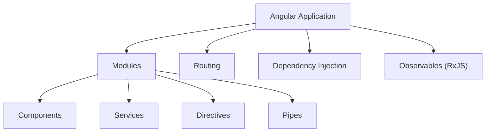
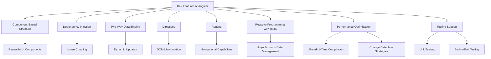
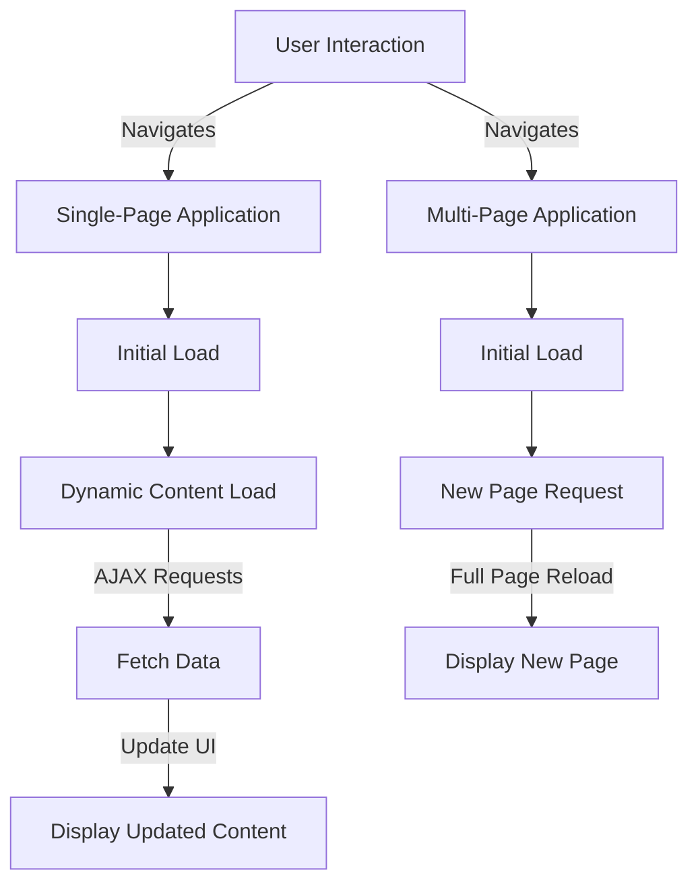
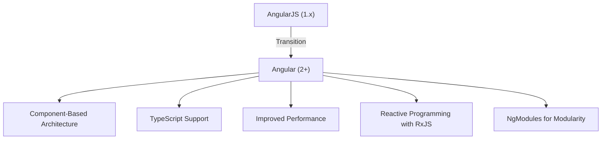

# MODULE-01 :

## 1. Introduction to Angular
- **What is Angular?**
  - A modern web application framework maintained by Google.
  - Built for developing single-page applications (SPAs) with a modular architecture.
- **History and Evolution**
  - Transition from AngularJS (Angular 1.x) to Angular (2+).
  - Overview of Angular’s version history and major changes.
- **Setup**
  - **System Requirements:** Node.js version and npm.
  - **Angular CLI:** Installing and using the Angular Command Line Interface.
  - **Creating an Angular Project:** Using commands like `ng new`, and `ng serve`.
- **Project Structure**
  - Detailed explanation of files and folders generated by Angular CLI:
    - `src/app`: Contains components, services, and modules.
    - `assets`: Static assets like images and stylesheets.
    - `environments`: Configuration for different environments (dev, prod).

---

# What is Angular?
Angular is a powerful, modern web application framework developed and maintained by Google. It is specifically designed for building single-page applications (SPAs) that provide a seamless user experience through dynamic content updates without requiring a full page reload.

## Key Characteristics of Angular

### 1. Framework Type:

- Angular is a complete, opinionated framework that offers a rich set of tools and features for web application development. Unlike libraries, which often require additional tools to manage application architecture, Angular provides a cohesive platform for building applications.

### 2. Single-Page Application (SPA) Development:

- SPAs load a single HTML page and dynamically update content as the user interacts with the app. This approach minimizes server requests and enhances performance, providing users with a smooth and responsive experience.
- Angular achieves this through its sophisticated routing system, which enables navigation between different views without page reloads.

### 3. Modular Architecture:

- Angular's architecture is built around modules, which encapsulate related components, services, directives, and pipes. This modular approach promotes reusability and maintainability of code, making it easier to manage large applications.
- Modules can be lazy-loaded, allowing parts of the application to be loaded on-demand, further enhancing performance.

## Core Features

### 1. Component-Based Structure:

- Angular applications are constructed using components, which are self-contained units of the user interface. Each component consists of an HTML template, a TypeScript class, and associated styles.
- This structure allows developers to build reusable UI components, improving consistency and reducing redundancy.

### 2. Dependency Injection:

- Angular has a powerful dependency injection (DI) system that facilitates the management of service instances and promotes loose coupling between components and services.
- DI makes it easier to test applications by allowing the injection of mock services during unit tests.

### 3. Two-Way Data Binding:

- Angular implements two-way data binding, which synchronizes data between the model and the view. Changes in the model automatically update the view, and vice versa, simplifying the process of handling user input and dynamic content.

### 4. Directives:

Directives are special markers in the DOM that tell Angular to attach specific behavior to elements or manipulate the DOM in specific ways. Angular provides built-in directives (like ngIf and ngFor) and allows developers to create custom directives.

### 5. Routing:

The Angular Router enables navigation between different views or components in the application. It supports features such as nested routes, route parameters, and lazy loading.

### 6. RxJS for Reactive Programming:

Angular leverages RxJS, a library for reactive programming using Observables, allowing developers to manage asynchronous data streams efficiently. This is particularly useful in handling user events, HTTP requests, and more.

### 7. Performance Optimization:

Angular includes various performance optimization techniques, such as Ahead-of-Time (AOT) compilation, tree-shaking, and change detection strategies. These features enhance application load times and responsiveness.

### 8. Testing Support:

Angular is built with testing in mind. It provides tools and utilities for unit testing components and services (using Jasmine and Karma) and end-to-end testing (using Protractor or Cypress).

## Ecosystem and Community
### 1.Strong Community Support: 
Angular benefits from a vibrant community contributing to its growth, with extensive documentation and numerous third-party libraries.
### 2.Rich Ecosystem: 
Angular features a vast ecosystem of libraries and tools, including Angular CLI for project setup, Angular Material for UI components, and NgRx for state management.

## Single-Page Applications (SPAs) vs Multi-Page Applications (MPAs)

### Definitions

- **Single-Page Application (SPA):** An SPA loads a single HTML page and dynamically updates the content as the user interacts with the app. It uses AJAX requests to fetch data and manipulate the DOM without reloading the entire page.

- **Multi-Page Application (MPA):** An MPA consists of multiple pages, each loaded separately from the server. Each user interaction that requires new content typically results in a full page reload.

### Examples

- SPA Example:
**Google Maps:** Users can navigate the map, search for locations, and view details without the entire page refreshing.
- MPA Example:
**E-commerce Websites:** Traditional e-commerce sites like Amazon often reload the page when users navigate between categories, product pages, and checkout processes.

## Advantages of SPA over MPA

1. **Performance:** SPAs often load faster after the initial load because only data is fetched rather than whole pages, reducing server load and network latency.

2. **User Experience:** SPAs provide a smoother and more fluid user experience, resembling native applications due to their ability to update content dynamically without full page reloads.

3. **Reduced Server Load:** Since SPAs fetch data asynchronously and do not require reloading the entire page, they can reduce the overall number of requests to the server.

4. **State Management:** SPAs manage the application's state more effectively, allowing users to return to the previous state without losing data, unlike MPAs, which may reset state on navigation.

5. **Development Efficiency:** SPAs allow developers to work more effectively by using modern frameworks (like Angular, React, or Vue.js) that streamline the development process.

## Comparision Table

| Feature                      | Single-Page Application (SPA)            | Multi-Page Application (MPA)          |
|------------------------------|------------------------------------------|---------------------------------------|
| **Page Load**                | Single page loads; content updates dynamically | Multiple pages load separately       |
| **User Experience**          | Smooth and fluid; similar to native apps | Slower; requires full page reloads    |
| **Performance**              | Faster after initial load                | Slower due to repeated loading of pages|
| **Development Complexity**    | Can be complex due to state management and routing | Generally simpler for small applications |
| **SEO Optimization**         | More challenging; requires prerendering | Easier; each page can be indexed     |
| **Server Load**              | Reduced due to fewer requests            | Higher; multiple requests for each page |
| **Caching**                  | Easier to cache and manage data          | Caching can be complicated             |

# History and Evolution of Angular
---

## 1. Transition from AngularJS (Angular 1.x) to Angular (2+)

### A. AngularJS (Angular 1.x)

- **Release Year:** 2010
- **Architecture:** Based on a Model-View-Controller (MVC) architecture.
- **Key Features:**
- **Two-Way Data Binding:** Automatic synchronization between the model and view.
- **Dependency Injection:** Facilitates code reusability and testing.
- **Directives:** Extend HTML with custom attributes.
- **Scope Objects:** Manage data binding and the application model.

#### Reasons for Transition

- **Performance Issues:** AngularJS struggled with performance in large applications, particularly with complex UIs.
- **Complexity:** Difficulties in managing larger codebases and testing effectively.
- **Need for Modernization:** The rise of mobile applications and the demand for modern web practices required a more robust framework.

### B.Angular (2+)

- **Release Year:** 2016
- **Architecture:** Component-based architecture, moving away from MVC.

- **Key Features:**
    - **Improved Performance:** Faster rendering and better performance metrics.
    - **Modularity:** Introduced NgModules for better organization of code.
    - **Reactive Programming:** Utilized Observables with RxJS for managing asynchronous data streams.
    - **TypeScript Support:** Enhanced tooling and static typing capabilities.
    - **Improved Dependency Injection:** Simplified service management.

**Transition Overview**
The shift from AngularJS to Angular marked a significant transformation, requiring developers to embrace new paradigms, tools, and practices. This transition aimed to enhance maintainability, scalability, and performance in web application development.

## 2. Overview of Angular’s Version History and Major Changes

**Version History**

| Version | Release Year | Major Changes                                         |
|---------|--------------|-------------------------------------------------------|
| **1.x** | **2010**     | Initial release of AngularJS; MVC architecture.      |
| **2**   | **2016**     | Complete rewrite; component-based architecture.      |
| **4**   | **2017**     | Introduced AOT compilation; improved router.         |
| **5**   | **2017**     | Added build optimizer; new HttpClient.               |
| **6**   | **2018**     | Ivy preview; CLI enhancements; RxJS improvements.     |
| **7**   | **2018**     | Virtual scrolling; improved CLI; new Angular update process. |
| **8**   | **2019**     | Differential loading; lazy loading with dynamic imports. |
| **9**   | **2020**     | Ivy rendering engine as default; improved build times. |
| **10**  | **2020**     | New date range picker; optional stricter settings in CLI. |
| **11**  | **2020**     | Improved logging; automatic font inlining; enhanced support for web components. |
| **12**  | **2021**     | Improved build performance; stricter types for reactive forms. |
| **13**  | **2021**     | Updated Angular CLI; new APIs for dynamic component creation. |
| **14**  | **2022**     | Streamlined API; improved developer ergonomics; new features in Angular CLI. |
| **15**  | **2023**     | Enhanced error handling; new utilities for better performance. |
| **16**  | **2023**     | Further improvements to developer experience; updates to the Ivy engine. |
| **17**  | **2024**     | Major enhancements in forms and state management; new capabilities for routing and performance. |

```mermaid
graph TD;
   subgraph VersionHistory
        A1["AngularJS 1.x(2010)"] --> A2["Angular 2(2016)"]
        A2 --> A3["Angular 4(2017)"]
        A3 --> A4["Angular 5(2017)"]
        A4 --> A5["Angular 6(2018)"]
        A5 --> A6["Angular 7(2018)"]
        A6 --> A7["Angular 8(2019)"]
        A7 --> A8["Angular 9(2020)"]
        A8 --> A9["Angular 10(2020)"]
        A9 --> A10["Angular 11(2020)"]
        A10 --> A11["Angular 12(2021)"]
        A11 --> A12["Angular 13(2021)"]
        A12 --> A13["Angular 14(2022)"]
        A13 --> A14["Angular 15(2023)"]
        A14 --> A15["Angular 16(2023)"]
        A15 --> A16["Angular 17(2024)"]
    end
```

### Angular LTS Versions

| Version   | Release Date  | LTS Support Until |
|-----------|---------------|--------------------|
| Angular 6 | May 2018      | May 2020           |
| Angular 7 | October 2018  | November 2020      |
| Angular 8 | May 2019      | November 2021      |
| Angular 9 | February 2020 | May 2022           |
| Angular 10| June 2020     | November 2022      |
| Angular 11| November 2020 | November 2023      |
| Angular 12| May 2021      | November 2023      |
| Angular 13| November 2021 | May 2024           |
| Angular 14| June 2022     | November 2024      |
| Angular 15| November 2022 | May 2025           |
| Angular 16| May 2023      | November 2025      |
| Angular 17| November 2023 | May 2026           |

### New Features and Changes in Angular 17

1. **Enhanced Forms API**
   - Streamlined and powerful API for reactive forms.
   - Improved validation capabilities, including async validators.

2. **State Management Improvements**
   - New utilities and features for effective application state management.
   - Enhanced integration with NgRx for simpler state management patterns.

3. **Improved Router Features**
   - New capabilities for lazy loading modules.
   - Enhanced route guards and resolvers for better navigation handling.

4. **Performance Optimizations**
   - Further optimizations in change detection mechanisms.
   - Reduced bundle sizes and improved load times via advanced tree-shaking techniques.

5. **New Directives**
   - Introduction of new built-in directives for common tasks.
   - Improved lifecycle hooks for better component and directive management.

6. **Improved Error Handling**
   - Enhanced mechanisms for clearer error messages.
   - New tools for debugging and managing errors in the development environment.

7. **TypeScript 5.x Support**
   - Full compatibility with the latest TypeScript version for improved type checking and performance.

8. **Ivy Engine Enhancements**
   - Refinements to the Ivy rendering engine for better performance and features.
   - Improved support for dynamic component creation.

9. **CLI 
