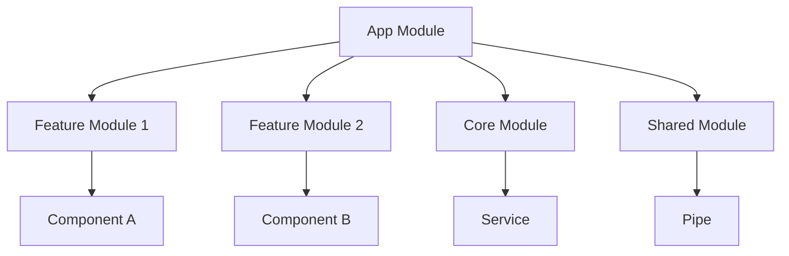
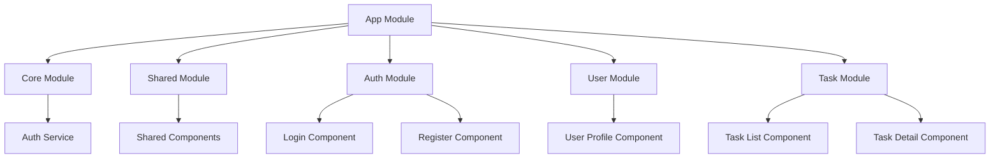

# 2. Angular Fundamentals
- **Modules and NgModules**
  - **Definition:** A container for a cohesive block of code dedicated to an application domain, a workflow, or a closely related set of capabilities.
  - **Root Module:** The entry point for Angular applications, typically `AppModule`.
  - **Feature Modules:** Modularization of functionalities for better organization and lazy loading.
  - **Core and Shared Modules:** Core for singleton services and Shared for reusable components and directives.
- **Components and Templates**
  - **Component Decorators:** Understanding `@Component` metadata properties (selector, templateUrl, styleUrls).
  - **Lifecycle Hooks:** Detailed overview of hooks like `ngOnInit`, `ngOnChanges`, `ngOnDestroy`, etc.
  - **Template Syntax:**
    - Interpolation, property binding, event binding.
    - Template reference variables.
- **Data Binding**
  - **One-Way Data Binding:**
    - Interpolation (`{{ }}`).
    - Property binding (`[property]="value"`).
    - Event binding (`(event)="handler()"`).
  - **Two-Way Data Binding:** Using `[(ngModel)]` for forms, understanding how it combines property and event binding.
- **Directives**
  - **Types of Directives:**
    - **Structural Directives:** Modify the DOM layout (e.g., `*ngIf`, `*ngFor`, `*ngSwitch`).
    - **Attribute Directives:** Change the appearance or behavior of an element (e.g., `ngClass`, `ngStyle`).
  - **Creating Custom Directives:** Step-by-step process to create your own directive and apply it in templates.


# 📦 Modules and NgModules in Angular 🌟

Angular applications are modular in nature, meaning they are divided into smaller, more manageable parts called modules. This modular structure helps in organizing the application effectively.

## 🎯 What are Modules?

Modules are containers for a cohesive block of code dedicated to an application domain, a workflow, or a closely related set of capabilities.

#### **Key Features:**
- **Encapsulation:** Modules encapsulate components, directives, pipes, and services.
- **Reusability:** You can reuse modules across different applications.
- **Lazy Loading:** Modules can be loaded on demand, which improves performance.

## 📚 Understanding NgModules

NgModules is a class marked by the @NgModule decorator. An NgModule defines a compilation context for a subset of an application. It collects related code into functional sets.

### NgModule Properties:

- **declarations:** The components, directives, and pipes that belong to this module.
- **imports:** Other modules whose exported classes are needed by component templates in this module.
- **exports:** The subset of declarations that should be visible and usable in the component templates of other modules.
- **providers:** The services available in the injector of this module.

- **bootstrap:** The main application view, called the root component, which hosts all other app views.

- **Example**
  ```typescript
     import { NgModule } from '@angular/core';
     import { BrowserModule } from '@angular/platform-browser';
     import { AppComponent } from './app.component';

     @NgModule({
        declarations: [AppComponent],
        imports: [BrowserModule],
        providers: [],
        bootstrap: [AppComponent]
     })
     export class AppModule { }
  ```

### 🌐 Types of Modules in Angular

1. **Root Module:** The main module of the application, typically AppModule.
2. **Feature Modules:** Used to organize related functionality, like UserModule, AdminModule, etc.
3. **Shared Module:** Contains common components, directives, and pipes that can be shared across the application.
4. **Core Module:** Contains singleton services used in the application.

### 📊 Module Structure in Angular



### ⚡ Benefits of Using NgModules

- **Organized Code Structure:** Improves maintainability and readability.
- **Lazy Loading:** Enhances performance by loading modules only when needed.
- **Modularity:** Encourages code reuse and separation of concerns.
- **Easy Testing:** Facilitates unit testing by isolating code.


### 🛠️ Creating a Feature Module

**Step-by-Step Guide:**

1. **Generate a Module:** Use the Angular CLI to create a new module:

```bash
ng generate module feature-name
```
2. **Declare Components:** Add components to the declarations array in the @NgModule decorator.

3. **Import Necessary Modules:** Import any required Angular modules.

4. **Export Components (if needed):** Export components that need to be used in other modules.

**Example**
```typescript
    import { NgModule } from '@angular/core';
    import { CommonModule } from '@angular/common';
    import { FeatureComponent } from './feature.component';

    @NgModule({
    declarations: [FeatureComponent],
    imports: [CommonModule],
    exports: [FeatureComponent]
    })
    export class FeatureModule { }
```

### 📋 Summary

- Modules are crucial for organizing an Angular application.
- NgModules encapsulate components, services, and other code, promoting reusability and lazy loading.
- The structure of modules can significantly improve the maintainability and performance of applications.

🎉 **Congratulations!** You now have a foundational understanding of **Modules and NgModules** in Angular!


### 📚 Case Study: Building a Modular Angular Application

#### 🌟 Scenario Overview

Imagine we are building a Task Management Application. This application allows users to manage their tasks efficiently by organizing them into different categories such as personal, work, and shopping. The application will be divided into several modules to enhance maintainability, reusability, and scalability.

#### 🗂️ Modules Structure

The application will consist of the following modules:

1. **Core Module:** Contains singleton services used across the app (e.g., authentication service).
2. **Shared Module:** Includes common components, directives, and pipes shared across multiple feature modules (e.g., buttons, modals).
3. **Feature Modules:**
    - TaskModule: For managing tasks.
    - UserModule: For managing user profiles.
    - AuthModule: For handling authentication.



####  🚀 Module Implementation Steps

**1. Setting Up Core Module**
**Purpose:** To provide services that will be used throughout the application.

**Implementation:**
```typescript
import { NgModule } from '@angular/core';
import { CommonModule } from '@angular/common';
import { AuthService } from './services/auth.service';

@NgModule({
  imports: [CommonModule],
  providers: [AuthService],
  exports: []
})
export class CoreModule { }
```
**2. Setting Up Shared Module**

**Purpose:** To create reusable components, directives, and pipes.

**Implementation:**

```typescript
    import { NgModule } from '@angular/core';
    import { CommonModule } from '@angular/common';
    import { SharedButtonComponent } from './components/shared-button/shared-button.component';

    @NgModule({
    declarations: [SharedButtonComponent],
    imports: [CommonModule],
    exports: [SharedButtonComponent]
    })
    export class SharedModule { }
```

**3. Setting Up Auth Module**

**Purpose:** To manage authentication functionalities.

**Implementation:**

```typescript
    import { NgModule } from '@angular/core';
    import { CommonModule } from '@angular/common';
    import { LoginComponent } from './login/login.component';
    import { RegisterComponent } from './register/register.component';

    @NgModule({
    declarations: [LoginComponent, RegisterComponent],
    imports: [CommonModule],
    exports: []
    })
    export class AuthModule { }
```

**4. Setting Up User Module**

**Purpose:** To manage user profiles and related functionalities.
**Implementation:**
```typescript
    import { NgModule } from '@angular/core';
    import { CommonModule } from '@angular/common';
    import { UserProfileComponent } from './user-profile/user-profile.component';

    @NgModule({
    declarations: [UserProfileComponent],
    imports: [CommonModule],
    exports: []
    })
    export class UserModule { }
```

**5. Setting Up Task Module**

**Purpose:** To manage tasks and related functionalities.

**Implementation:**

```typescript
    import { NgModule } from '@angular/core';
    import { CommonModule } from '@angular/common';
    import { TaskListComponent } from './task-list/task-list.component';
    import { TaskDetailComponent } from './task-detail/task-detail.component';

    @NgModule({
    declarations: [TaskListComponent, TaskDetailComponent],
    imports: [CommonModule],
    exports: []
    })
    export class TaskModule { }
```

#### 📜 Summary

In this case study, we developed a Task Management Application with a modular architecture that includes:

- Core Module for services.
- Shared Module for reusable components.
- Feature Modules for specific functionalities such as authentication, user management, and task management.

This modular approach not only enhances the maintainability and scalability of the application but also encourages code reusability. As the application grows, we can easily add new features by creating additional modules without affecting existing code.


