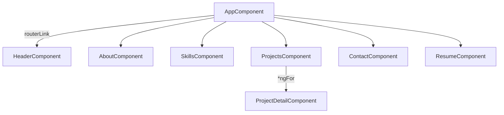
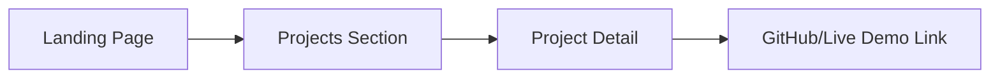

# Personal Portfolio Website using Angular

---

**Objective:** To create a visually appealing, responsive, and fully functional portfolio website using Angular and Bootstrap. The website includes sections like About, Skills, Projects, Contact, and Resume.

### Table of Contents

- Project Overview
- Tech Stack
- Features
- Architecture and Components
- Setup Instructions
- Sample Design
- Conclusion

---

### Project Overview

A personal portfolio website showcases your skills, experiences, projects, and achievements. Built using Angular 17 and Bootstrap 5, this project provides a modern, responsive design that adapts to all screen sizes and is easy to update as your portfolio grows.

### Tech Stack
**Framework:** Angular 17
**CSS Framework:** Bootstrap 5
**Icons:** Font Awesome, Angular Material Icons
**Design Tools:** Visual Studio Code, Figma for wireframes (optional)

### Features

**Core Features**

- `Landing Section:` Includes a personal image, a greeting message, and a short introduction.

- `About Section:` Displays an overview of background, goals, and expertise.

- `Skills Section:` Lists technical skills with proficiency levels.

- `Projects Section:` Showcases featured projects with descriptions, tech stacks, and links to demos or GitHub repositories.

- `Contact Section:` Contact form with email and social media links.

- `Resume Section:` Provides a downloadable resume button


### Architecture and Components

Using Angular’s component-based structure makes each section modular and easily maintainable. The following components and modules are created for the portfolio website:


- `AppComponent:` Root component to hold the entire layout and handle routing.
- `HeaderComponent:` Contains the navigation bar and links to different sections.
-`AboutComponent:` Provides details about the individual.
- `SkillsComponent:` Lists skills using a horizontal progress bar.
- `ProjectsComponent:` Displays a list of projects.
- `ProjectDetailComponent:` Shows individual project details, accessible through dynamic routing.
-`ContactComponent:` Includes a form for messages and social media icons.
-`ResumeComponent:` Offers a button to download the resume.

### Setup Instructions

#### **1. Create a New Angular Project**

```bash
ng new personal-portfolio
cd personal-portfolio
```
#### **2. Install Dependencies**

Install Bootstrap and Font Awesome:

```bash
npm install bootstrap font-awesome
```

Add the following to `angular.json` under `styles` and `scripts`:

```json
"styles": [
  "node_modules/bootstrap/dist/css/bootstrap.min.css",
  "src/styles.css"
],
"scripts": [
  "node_modules/bootstrap/dist/js/bootstrap.bundle.min.js"
]
```

#### **3. Create Components**
Generate each component:

```bash
ng generate component components/header
ng generate component components/about
ng generate component components/skills
ng generate component components/projects
ng generate component components/contact
ng generate component components/resume
```

#### **4. Set Up Routing**

Define routes in `app-routing.module.ts`:

```typescript
const routes: Routes = [
  { path: '', redirectTo: '/about', pathMatch: 'full' },
  { path: 'about', component: AboutComponent },
  { path: 'skills', component: SkillsComponent },
  { path: 'projects', component: ProjectsComponent },
  { path: 'contact', component: ContactComponent },
  { path: 'resume', component: ResumeComponent }
];
```

#### **5. Style Components with Bootstrap**

Example for AboutComponent:

```html
<!-- about.component.html -->
<section class="container text-center mt-5">
  <h2 class="text-primary">About Me</h2>
  <p class="lead mt-3">I'm a passionate developer with experience in Angular, JavaScript, and web development...</p>
</section>
```

#### **6. Add Icons**
Use Font Awesome icons to add visual interest:

```html
<i class="fa fa-github text-secondary" aria-hidden="true"></i>
```



### Project Structure

```plaintext
src/
├── app/
│   ├── components/
│   │   ├── header/
│   │   │   ├── header.component.ts
│   │   │   ├── header.component.html
│   │   │   ├── header.component.css
│   │   ├── about/
│   │   │   ├── about.component.ts
│   │   │   ├── about.component.html
│   │   │   ├── about.component.css
│   │   ├── skills/
│   │   │   ├── skills.component.ts
│   │   │   ├── skills.component.html
│   │   │   ├── skills.component.css
│   │   ├── projects/
│   │   │   ├── projects.component.ts
│   │   │   ├── projects.component.html
│   │   │   ├── projects.component.css
│   │   ├── contact/
│   │   │   ├── contact.component.ts
│   │   │   ├── contact.component.html
│   │   │   ├── contact.component.css
│   │   └── resume/
│   │       ├── resume.component.ts
│   │       ├── resume.component.html
│   │       ├── resume.component.css
│   ├── app.component.html
│   ├── app-routing.module.ts
│   ├── app.module.ts

```

### 1. Header Component

`header.component.html`

```html
<nav class="navbar navbar-expand-lg navbar-light bg-light">
  <a class="navbar-brand" href="#">My Portfolio</a>
  <button class="navbar-toggler" type="button" data-toggle="collapse" data-target="#navbarNav" aria-controls="navbarNav" aria-expanded="false" aria-label="Toggle navigation">
    <span class="navbar-toggler-icon"></span>
  </button>
  <div class="collapse navbar-collapse" id="navbarNav">
    <ul class="navbar-nav ml-auto">
      <li class="nav-item"><a class="nav-link" routerLink="/about">About</a></li>
      <li class="nav-item"><a class="nav-link" routerLink="/skills">Skills</a></li>
      <li class="nav-item"><a class="nav-link" routerLink="/projects">Projects</a></li>
      <li class="nav-item"><a class="nav-link" routerLink="/contact">Contact</a></li>
      <li class="nav-item"><a class="nav-link" routerLink="/resume">Resume</a></li>
    </ul>
  </div>
</nav>
```
### 2. About Component

`about.component.html`

```html
<section class="container text-center mt-5">
  <h2 class="text-primary">About Me</h2>
  <p class="lead mt-3">I'm a passionate developer with experience in Angular, JavaScript, and web development...</p>
</section>
```

### 3. Skills Component

`skills.component.html`

```html
<section class="container mt-5">
  <h2 class="text-primary">My Skills</h2>
  <div class="mt-3">
    <h5>Angular</h5>
    <div class="progress">
      <div class="progress-bar bg-success" role="progressbar" style="width: 90%;">90%</div>
    </div>
    <h5>JavaScript</h5>
    <div class="progress">
      <div class="progress-bar bg-info" role="progressbar" style="width: 80%;">80%</div>
    </div>
  </div>
</section>
```
### 4. Projects Component

`projects.component.html`

```html
<section class="container mt-5">
  <h2 class="text-primary">My Projects</h2>
  <div class="row mt-3">
    <div class="col-md-4" *ngFor="let project of projects">
      <div class="card">
        
        <div class="card-body">
          <h5 class="card-title">{{ project.name }}</h5>
          <p class="card-text">{{ project.description }}</p>
          <a href="{{ project.link }}" class="btn btn-primary">View Project</a>
        </div>
      </div>
    </div>
  </div>
</section>
```
### Sample Data in projects.component.ts

```typescript
export class ProjectsComponent {
  projects = [
    { name: 'Portfolio Website', description: 'A responsive portfolio website built with Angular', image: 'path/to/image', link: '#' },
    { name: 'E-commerce App', description: 'An e-commerce app with a complete cart system', image: 'path/to/image', link: '#' }
  ];
}
```
### 5. Contact Component

`contact.component.html`

```html
<section class="container mt-5">
  <h2 class="text-primary">Contact Me</h2>
  <form>
    <div class="form-group">
      <label for="name">Name</label>
      <input type="text" class="form-control" id="name" placeholder="Enter your name">
    </div>
    <div class="form-group">
      <label for="email">Email</label>
      <input type="email" class="form-control" id="email" placeholder="Enter your email">
    </div>
    <div class="form-group">
      <label for="message">Message</label>
      <textarea class="form-control" id="message" rows="4"></textarea>
    </div>
    <button type="submit" class="btn btn-primary mt-3">Send</button>
  </form>
</section>
```

### 6. Resume Component

`resume.component.html`

```html
<section class="container text-center mt-5">
  <h2 class="text-primary">Resume</h2>
  <p class="lead mt-3">Download my resume to learn more about my experience and skills.</p>
  <a href="path/to/resume.pdf" class="btn btn-primary" download>Download Resume</a>
</section>
```

